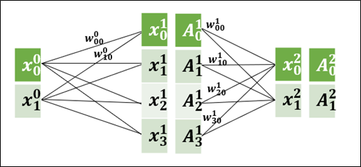
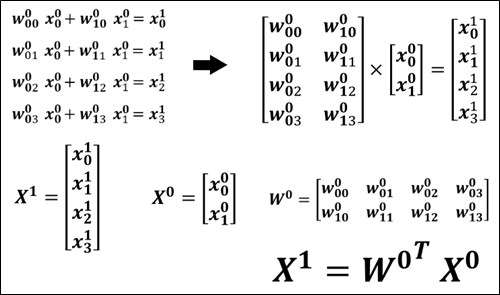
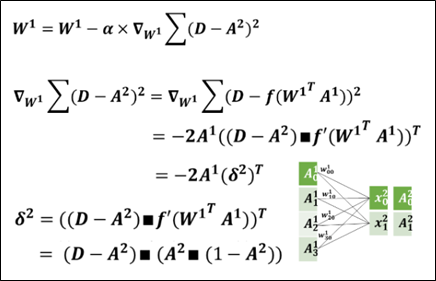
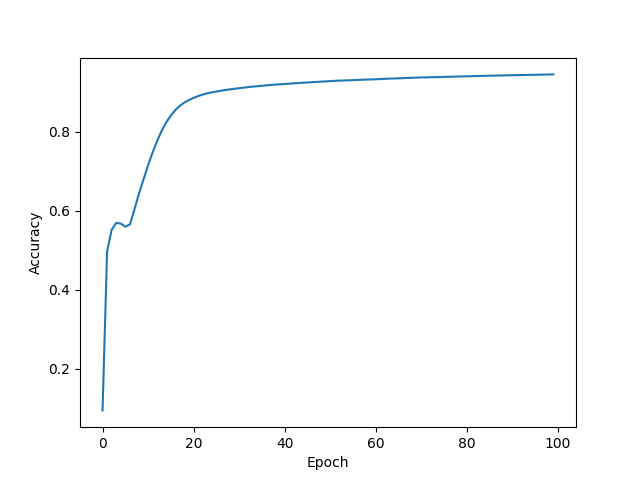

# 神經網路倒傳遞實驗

## 前言
本次實驗我們以手刻的方式來了解神經網路倒傳遞的原理，其中我們會介紹各個階段的程式碼以及它的數學原理。

### 數學介紹

在神經網路之中，最重要的是輸入值與權重之間的互動，所以我們需要先了解它們是如何運算，才能做後續的倒傳遞修正。

  
**圖1 神經網路示例**  

在正向傳遞當中，每一層輸入都會透過與權重相乘來到達下一層，我們可以將這個動作透過矩陣的方式來表達成下圖的樣子:

  
**圖2 正向傳遞公式推導** 

這樣一來，就可以將輸入X0傳遞至第一層X1了。  

再來我們需要訓練神經之間的連結權重，會透過計算gradient的大小來對我們的權重做調整，gradient越大調整的幅度會越大，反之gradient越小調整幅度越小。

  
**圖3 正向傳遞公式推導**  

公式中的乘法皆是內積，而方形點乘則是點對點直接作相乘，且將損失函數化簡可以幫助我們在程式碼當中實現反向傳遞。

### 學習準確度的時間曲線

透過繪製學習曲線，我們發現在訓練了30代以後準確度已經達到了90%以上，並持續緩慢增加，最後訓練到100代時準確度達94.5%。

  
**圖4 學習準確度時間曲線**  

## 結論

在這個練習過程中，我們使用了手寫數字的方式實現了一個簡單的多層感知器（MLP）來進行 MNIST 數字分類任務。透過這個過程，我們深入理解了神經網路的核心概念和訓練過程中的主要步驟。以下是我們的結論：

1. 正向傳遞：在正向傳遞過程中，我們將輸入數據通過神經網路，逐層計算權重加權的輸入，並應用激活函數來生成每一層的輸出。通過這個過程，我們得到了模型對輸入數據的預測結果。
2. 反向傳遞：反向傳遞是訓練神經網路的關鍵步驟。在這個過程中，我們首先計算了模型預測與真實值之間的誤差，然後使用這個誤差來計算每一層參數的梯度。最後，我們使用梯度下降算法來更新模型的參數，從而使模型的預測逐步接近真實值。
3. 訓練迴圈：通過多次迴圈運行訓練過程，我們觀察到模型的性能逐步提高。我們可以通過監控分類準確率來評估模型的訓練效果，並根據需要調整模型的參數和架構。

總結來說，這個練習過程幫助我們加深了對神經網路訓練過程的理解。
