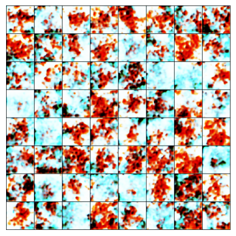

# 手刻生成對抗網絡 (GANs)

### 目錄
- 簡介
- 環境需求
- 資料集準備
- 使用方法
- 訓練參數
- 結果展示
- 注意事項

### 簡介
此程式實現了一個生成對抗網絡 (GANs)，該模型由一個生成器和一個判別器組成，並且使用 PyTorch 進行模型訓練。程式的目的是生成與輸入類別標籤相對應的圖像。具體來說，您可以通過該 GAN 模型，根據給定的隨機噪聲和類別標籤，生成類似於資料集中相應類別的圖片。  
範例程式使用 Kaggle 網站上的 [Pokemon Generation One](https://www.kaggle.com/datasets/thedagger/pokemon-generation-one) 資料集。


### 環境需求
您需要安裝以下環境和套件 :  
1. Python 3.6+
2. PyTorch
3. torchvision
4. PIL (Pillow)
5. matplotlib  
   
使用 pip 安裝所需的套件：
```
pip install torch torchvision matplotlib pillow
```
若使用 GPU 訓練，請安裝對應版本的 CUDA，並確保 PyTorch 正常配置 GPU。

### 資料集準備
資料集應放在 `assets/pokemon` 目錄下。每個子資料夾代表一個類別，並包含該類別的圖片，圖片格式必須為 `.jpg`。例如：
```
assets/pokemon/
  ├── class_1/
  │    ├── image_1.jpg
  │    ├── image_2.jpg
  │    └── ...
  ├── class_2/
  │    ├── image_1.jpg
  │    ├── image_2.jpg
  │    └── ...
  └── ...
```

### 使用方法
1. **檢查硬體：** 確認是否有 GPU 可用，程式會自動選擇 GPU 或 CPU。
2. **調整參數：** 根據需要調整訓練參數，如 `batch_size`, `epochs` 等（見下方的訓練參數部分）。
3. **運行程式：** 執行以下指令來開始訓練：
```
python GANs.py
```
4. **查看結果：** 程式每隔 10 個 epoch 會顯示生成的圖像，並輸出損失值曲線。

### 訓練參數
以下是程式中的一些主要訓練參數，您可以根據硬體資源和需求進行調整：

- `latent_dim`: 隨機噪聲的維度大小（預設：128）
- `image_size`: 圖像輸入大小，需與資料集的圖像大小匹配（預設：128）
- `batch_size`: 每次訓練的樣本數量（預設：64）
- `epochs`: 訓練的迭代次數（預設：100）
- `learning_rate`: 學習率（預設：0.0002）
- `beta1`: Adam 優化器的 beta1 參數（預設：0.5）

### 結果展示
在每次訓練時，程式會每 10 個 epoch 保存一次生成圖像的結果並顯示。您可以在終端中查看生成器和判別器的損失值，以及繪製的損失曲線圖。  
**Epoch = 0**  
  
**Epoch = 10**  
  
**Epoch = 30**  
  
**Epoch = 50**  
  
**訓練損失曲線圖**  
  

### 注意事項
1. 數據集格式：圖像需為 .jpg 格式，如果使用其他格式，請修改程式中讀取檔案的部分。
2. 類別數量：程式會自動檢測資料集中子資料夾的數量作為類別數，請確保每個類別的資料夾名稱唯一，且包含足夠的圖片進行訓練。
3. 硬體要求：如果您的 GPU 顯存較小，可以適當減少 batch_size 來避免記憶體不足。


