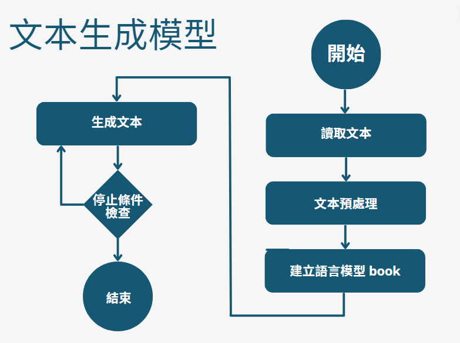

# 手刻語言模型 (Language Model)

這個專案使用馬爾可夫鏈（Markov Chain）來生成文本。通過分析給定的文本數據，程式可以生成連貫的文本序列。該程式包括文本讀取、馬爾可夫鏈模型建立、以及生成文本的功能。

## 檔案說明

- `data.txt`: 自備的訓練文本檔，應包含足夠的文本數據，以便用於生成模型的訓練。檔案應位於 `assets/` 資料夾中。
- `results/`: 儲存生成的文本結果的資料夾，若不存在會自動創建。

## 程式碼說明

1. **讀取文本**：
    - 從 `assets/data.txt` 讀取文本並進行預處理。
    - 使用結巴分詞（jieba）對文本進行分詞。

2. **建立馬爾可夫鏈模型**：
    - 構建兩個詞典 `book` 和 `book2` 用於存儲詞對的統計信息。
    - `book` 用於存儲詞和其後繼詞的出現次數。
    - `book2` 用於存儲詞和其後兩個詞的出現次數。

3. **生成文本**：
    - 使用馬爾可夫鏈模型從指定的起始詞生成連貫的文本。
    - 文本生成過程中會使用概率分佈來選擇下一個詞。

4. **儲存結果**：
    - 將生成的文本結果儲存到 `results/` 資料夾中，檔案名稱為當前時間戳。

### 流程圖



## 使用方法

1. 確保你已經安裝了 `numpy` 和 `jieba` 庫。如果尚未安裝，請運行以下命令：  
    ```
    pip install numpy jieba
    ```

2. 將你的文本數據儲存在 `assets/data.txt` 中。

3. 執行主程式：
    ```bash
    python script.py
    ```

4. 程式執行後，生成的文本將儲存在 `results/` 資料夾中，檔案名稱會以時間戳命名。

## 注意事項

- 確保 `assets/` 資料夾存在，且包含 `data.txt` 文件。


