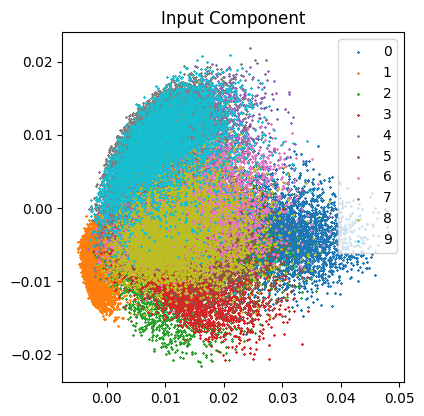
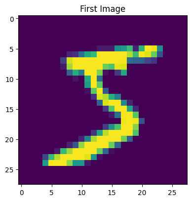
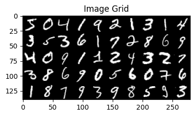
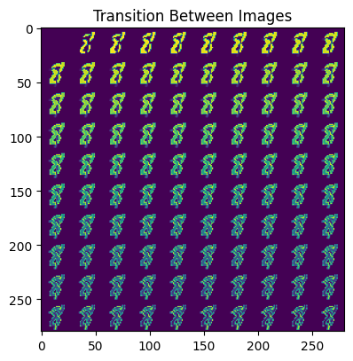
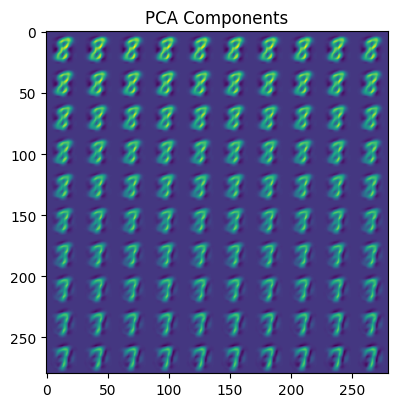
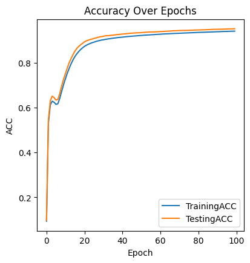

# 影像特徵提取

### 介紹
這個實驗包含了一個基於人工神經網路的影像特徵提取過程。主要目的是展示如何利用主成分分析 (PCA) 和神經網路進行影像數據的特徵提取和可視化。以下是步驟和結果的詳細說明。

### 程式說明
**數據可視化**
1. **降維後的數據分佈：**
   - 使用主成分分析 (PCA) 將數據降至二維，並顯示不同類別的數據分佈。  

2. **圖像顯示：**
   - 顯示第一張圖像。  

   - 顯示前 50 張圖像的網格。  

1. **圖像間的過渡：**
   - 顯示圖像之間的平滑過渡。  

1. **PCA 後的圖像：**
   - 顯示經過 PCA 降維後的圖像過渡效果。  

**神經網路訓練**
1. 神經網絡結構：
    - 設置一個兩層的神經網路，並使用隨機初始化的第二層權重。
2. 訓練過程：
    - 每個訓練輪次計算前向傳播和反向傳播的誤差。
    - 更新第二層權重。
3. 準確度計算：
    - 計算訓練和測試準確度，並將準確度隨輪次變化的曲線顯示出來。

**結果**
   - 準確度曲線：展示了訓練和測試準確度隨著訓練輪次的變化情況。  

### 使用方法
1. 確保 ANN0.npy, mnistLabel.npy, 和 mnist.npy 文件存在於工作目錄中。
2. 運行主程序腳本來執行數據處理、可視化以及神經網路訓練。

