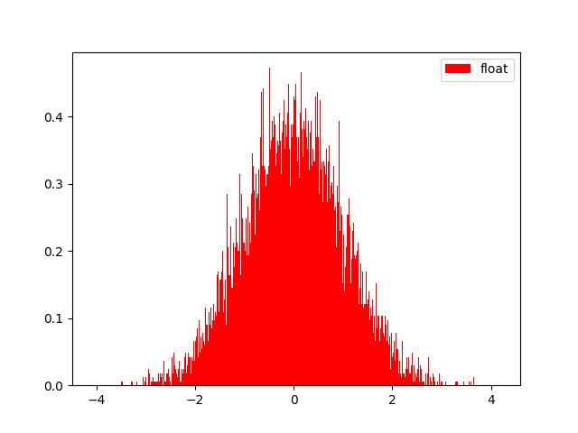
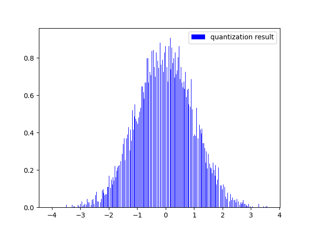
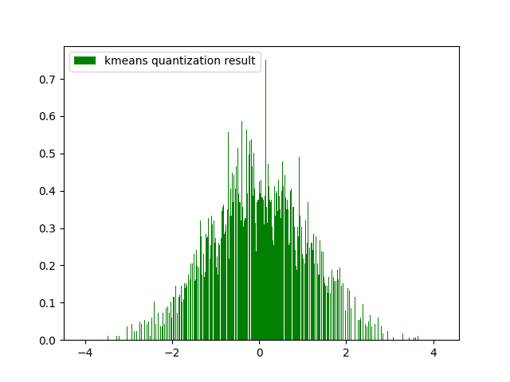
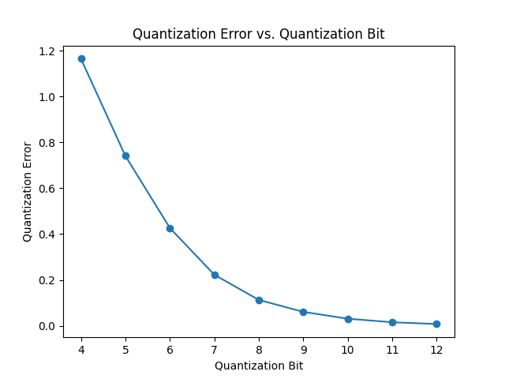

# Python 的量化實作

## 兩種量化方法簡介(線性量化、分群量化)

線性量化是一種數據壓縮技術，通過將連續範圍的數值映射到有限的離散值範圍來降低數據的表示大小。這通常涉及將較大範圍的數值分成固定間隔的離散等級，以減少數據的存儲和傳輸需求。線性量化可用於音訊、圖像和視頻壓縮，以節省空間和頻寬。然而，它可能會導致信息損失，因為原始細節會被捨棄或近似。

分群量化則是將數據分為多個群組，每個群組具有相似的特徵或特性。這些群組通常被稱為"簇"，每個簇可以用一個代表值（如平均值或中心）來表示。這種方法有助於減少數據的維度，提高了數據的簡潔性，並在不顯著失真的情況下減小了數據的大小。分群量化在許多應用中有廣泛的應用，包括數據壓縮、圖像壓縮、以及機器學習中的特徵提取。

## 執行的數值分布、誤差結果

#### Before Quantization

#### Linear Quantization
Error: 0.01702

#### Kmeans Quantization 
Error: 0.00470

#### 使用 Linear Quantization 映射到不同位元數的損失結果

## 結論
線性量化是一種將連續數值映射到有限離散值範圍的數據壓縮技術。儘管線性量化可能會導致信息損失，但在這次的實驗中，利用此方法取得相當成功的結果，誤差結果小於0.1，顯示了優秀的量化效果。
 
分群量化是通過將數據分成多個相似特性的群組，每個群組由一個代表值表示。這種方法在本次實驗中同樣取得成功的結果，誤差結果小於0.1，顯示了優秀的量化效果。分群量化不僅有助於減小數據大小，還提高了數據的簡潔性，顯示出其在數據壓縮和特徵提取方面的優勢。
 
由以上可知，線性量化和分群量化是兩種有效的數據壓縮方法，它們在本次實驗中成功的應用，為數據處理和傳輸提供了可靠的解決方案。
